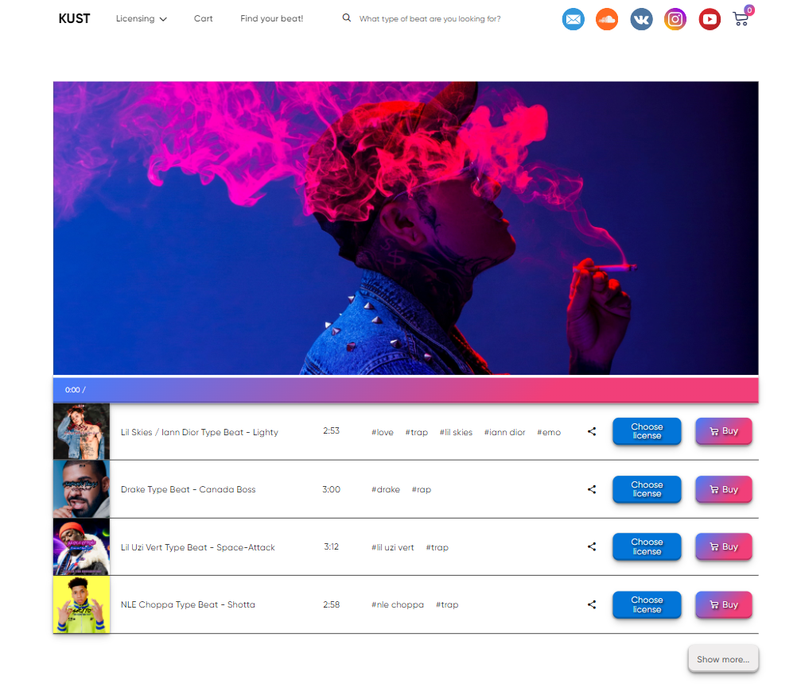
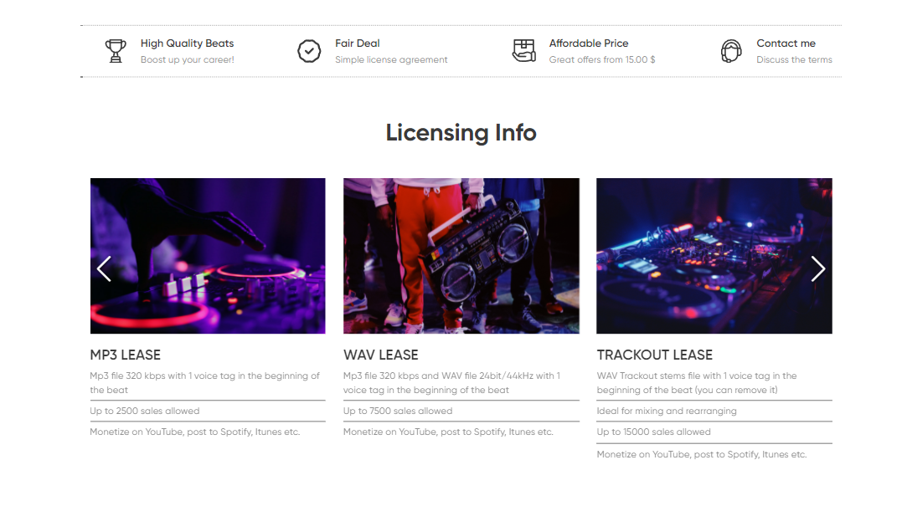
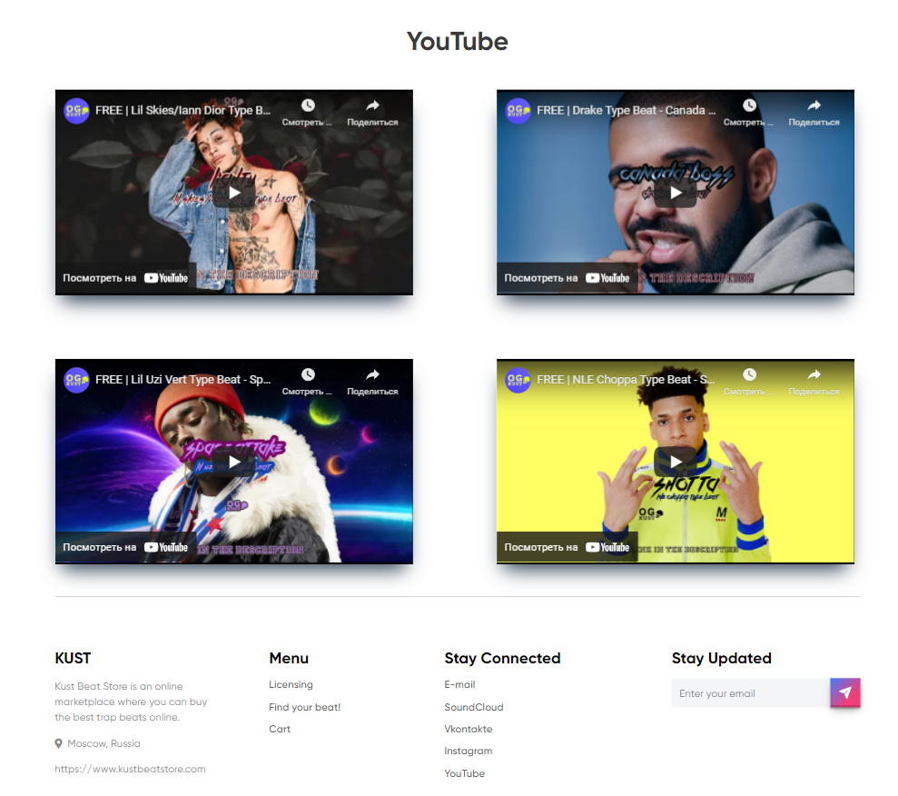
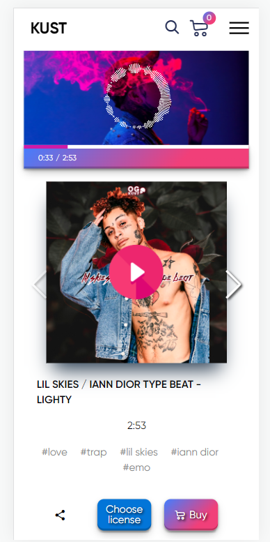
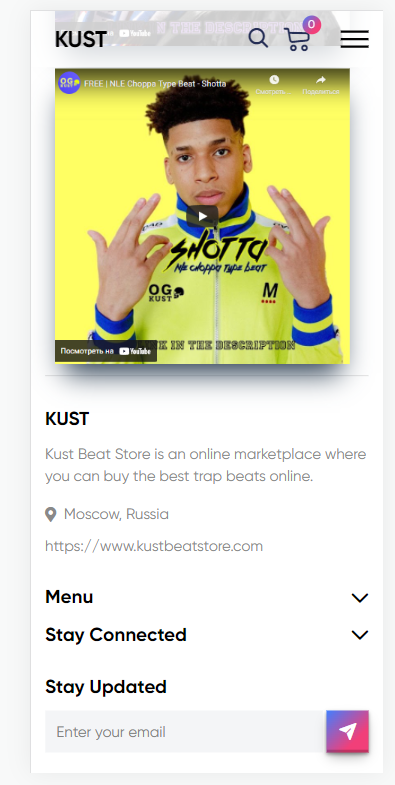
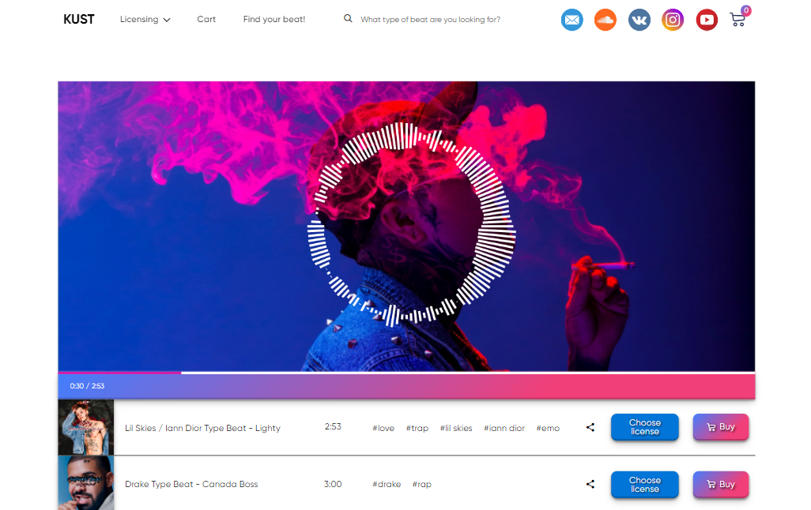
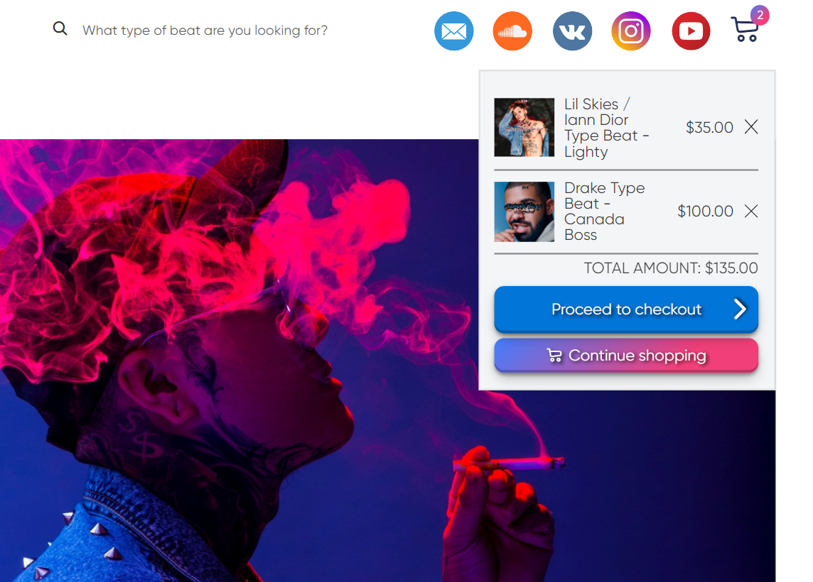
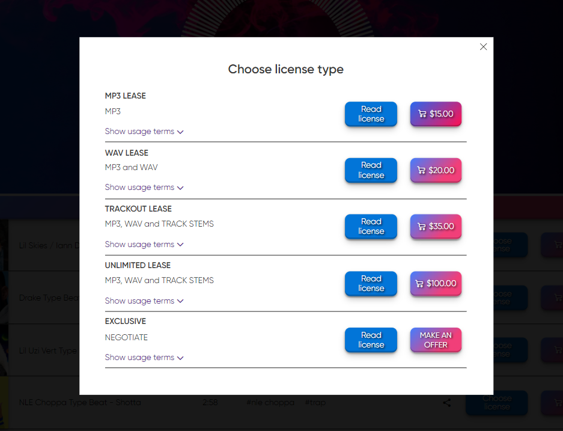
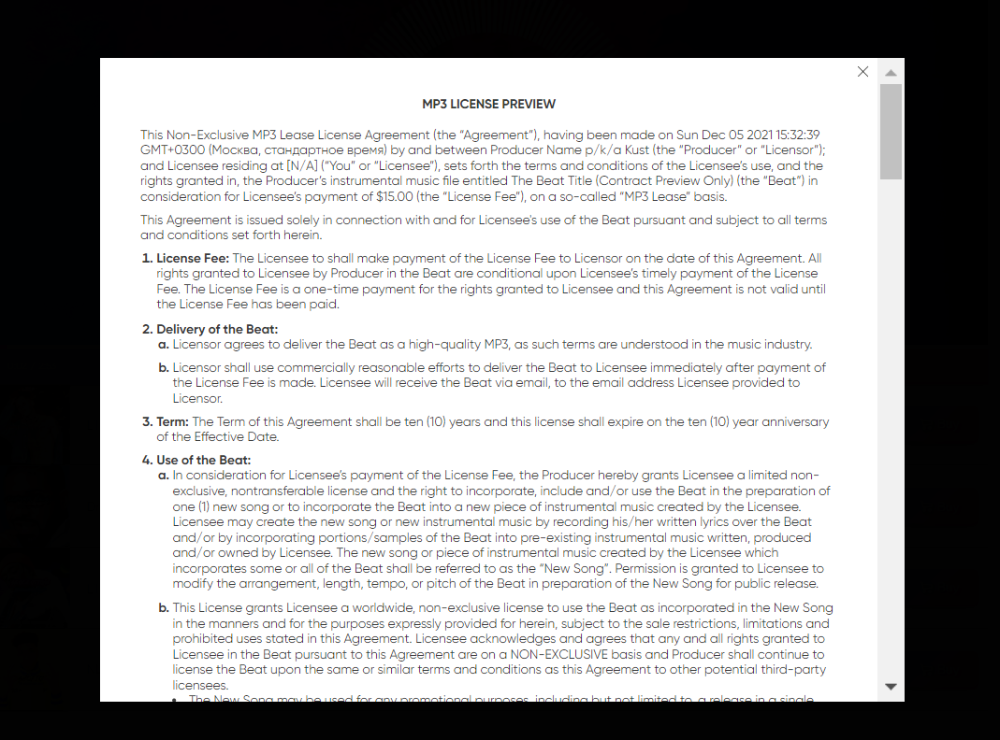

# kust-beats-store

<strong>Online beats store with cart, custom audio player and audio visualizer</strong>

<ul>
<li>HTML</li>
<li>SCSS</li>
<li>Vanilla JS (including popups)</li>
<li>GULP</li>
<li>JSON</li>
<li>Wave.js</li>
<li>Web Audio API</li>
<li>Swiper Slider</li>
</ul>

<strong>Swiper Slider</strong>

<strong>Adaptive design<strong>

  

<strong>Audio visualizer</strong>

<strong>Cart</strong>

<strong>Popups</strong>

